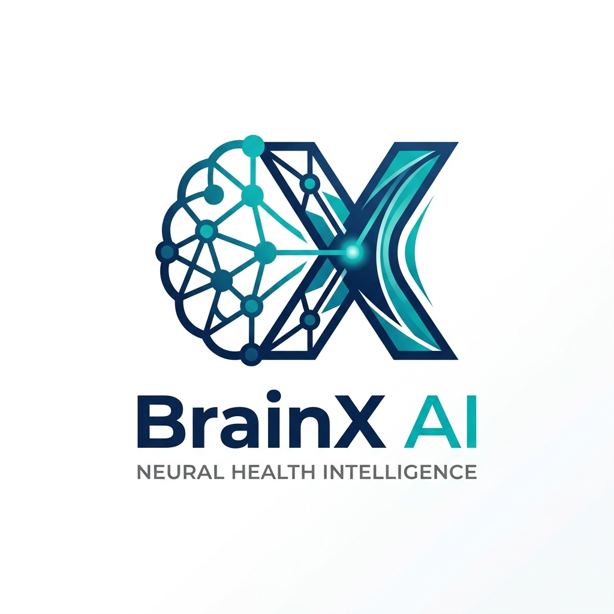

<div align="center">
  
  <h1>BrainXAI 🧠</h1>
  <p><strong>An Agentic AI-Powered Brain MRI Analysis and Explainable AI System</strong></p>
</div>

---

## 🏆 Hackathon Project
**Event:** Pak Angels Generative & Agentic AI Training — Cohort 11 (Final 2nd Hackathon)  
**Category:** Health Care  
**Team Leader:** Zaheer Ahmed  
**Team Members:** Azlan Ahmed, Humaiza, Wajeeha Asad, Ayesha Muazzama, Laiba Saeed  

---

## 📖 The Vision
BrainXAI is an Agentic AI-powered web application designed to act as a diagnostic copilot for neurologists and medical professionals. It solves the critical "black-box" AI problem by introducing **Explainable AI (Grad-CAM)** and **Agentic Workflows**, ensuring every prediction is verifiable, transparent, and easy to understand through automated clinical reporting.

## 🚀 Core Features
- **Automated Tumor Classification:** Uses PyTorch (EfficientNetV2-S) to detect Glioma, Meningioma, Pituitary, or No Tumor with mathematically calibrated confidence scores.
- **Explainable AI (Grad-CAM):** Generates visual heatmaps highlighting the exact regions of the MRI that influenced the AI’s decision.
- **Agentic AI Workflow:** Orchestrates the entire pipeline automatically without manual intervention.
- **Generative AI Reports:** Uses Groq's lightning-fast Engine (Llama 3 / Qwen) to synthesize raw probabilities and heatmaps into a natural-language clinical report.
- **Interactive AI Assistant:** A built-in medical chatbot that answers context-aware questions regarding the specific MRI scan results.
- **Secure & Responsive UI:** Unified authentication via Clerk, with a custom, 100% zoom-friendly responsive interface.

## 🛠 Technology Stack
### Frontend
- **React (Vite):** Blazing fast Single Page Application.
- **Clerk:** Enterprise-grade secure authentication.
- **Framer Motion:** Smooth micro-animations.
- **Vanilla CSS:** Custom, aesthetic UI design.

### Backend & AI
- **Python (FastAPI):** High-performance asynchronous backend server.
- **PyTorch & Torchvision:** Deep learning inference (EfficientNetV2-S).
- **OpenCV:** Heatmap overlay processing.
- **Groq API (Qwen/Llama3):** Lightning-fast Generative and Agentic AI workflow.
- **SQLite:** Lightweight local database for session and history management.

---

## 💻 How to Run Locally

### Prerequisites
- Node.js (v18+)
- Python (3.10+)
- A Groq API Key
- A Clerk Publishable Key

### Setup
1. **Clone the repository:**
   ```bash
   git clone https://github.com/zaheer-ahmed77/BrainX-AI.git
   cd BrainX-AI
   ```
2. **Environment Variables:**
   - In the root folder, create a `.env.local` file for the frontend:
     ```env
     VITE_CLERK_PUBLISHABLE_KEY=your_clerk_key_here
     ```
   - In the `backend` folder, create a `.env` file for the backend:
     ```env
     GROQ_API_KEY=your_groq_api_key_here
     CORS_ORIGINS=http://localhost:5173
     ```
3. **Model Weights:**
   Place your trained EfficientNetV2-S model inside `backend/models/brain_tumor_model.pth`.

### Launch the App
Windows users can simply double-click the included `run.bat` file, which automatically starts both the frontend and backend servers.
Alternatively:
```bash
# Terminal 1: Frontend
npm install
npm run dev

# Terminal 2: Backend
cd backend
python -m venv venv
venv\Scripts\activate
pip install -r requirements.txt
uvicorn main:app --reload
```

---
*Disclaimer: BrainXAI is an AI-assisted preliminary diagnostic tool and requires official clinical verification by certified medical professionals.*
